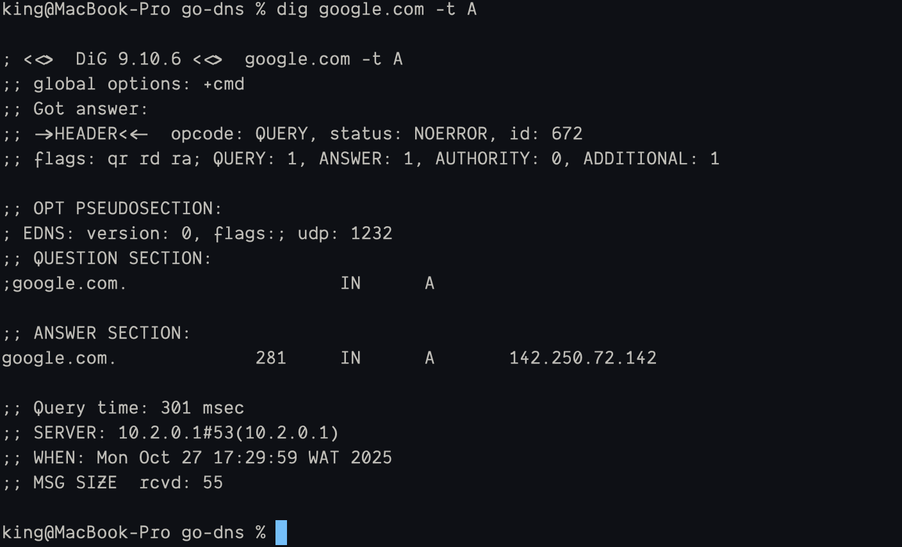
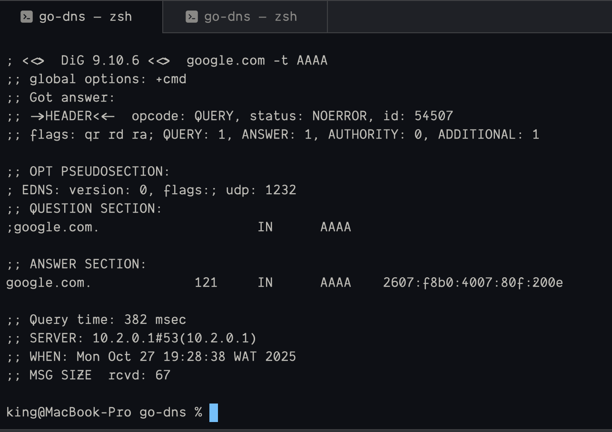
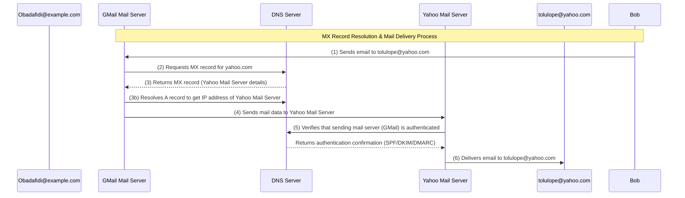
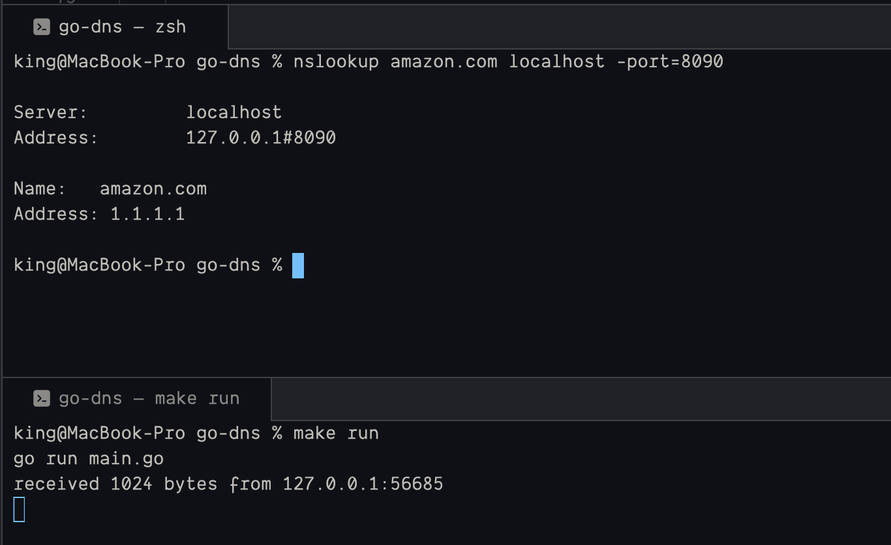
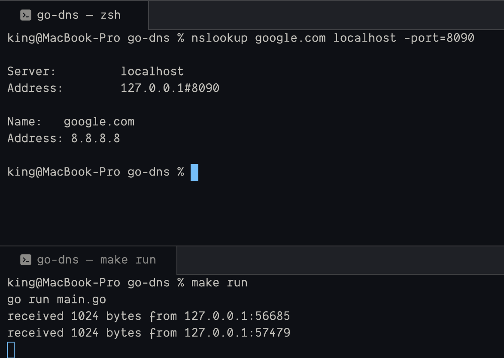
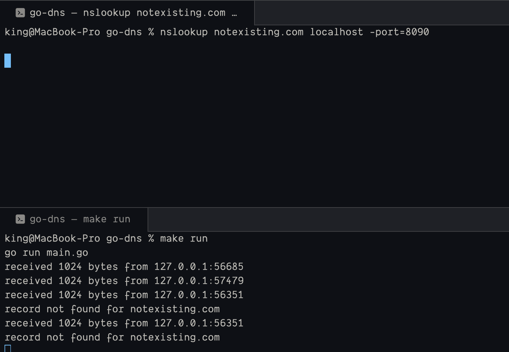

{/* ========================= SEO/METADATA =========================== */}

import { getBlogMetadata } from "@/lib/blogs.ts";
import info from "@/misc/info";

export const key = 'dns';

export const metadata = {
    title: `${getBlogMetadata(key).title} | ${info.me}`,
    description: getBlogMetadata(key).summary,
    icons: {
        icon: '/icon.svg'
    }
}

{/* ================================================================== */}

# Domain Name System (DNS)

## Resource Records

### 1. Address
This category of records contains the information about the IP address of a domain name. The IP address is used to locate the server that hosts the website or service. It is divide into 2

1. A (IPv4 Address); this is used to store the IPv4 address of a domain name.
2. AAAA (IPv6 Address); this is used to store the IPv6 address of a domain name.

```bash
    # get the ipv4 address of google.com
    dig google.com -t A
```


```bash

    # get the ipv6 address of google.com
    dig google.com -t AAAA
```



---

### 2. CNAME (Canonical Name)
This is used create alias for a domain name. For example if you have domain with `example.com`, and you also have `docs.example.com`, `drive.example.com`, these records still point to the same IP Address (`example.com`) but with different hostnames.

<table border="1">
  <thead>
    <tr>
      <th>Host</th>
      <th>Type</th>
      <th>Value</th>
    </tr>
  </thead>
  <tbody>
    <tr>
    <td>example.com</td>
    <td>A</td>
    <td>142.234.53.1</td>
    </tr>
    <tr>
      <td>docs.example.com</td>
      <td>CNAME</td>
      <td>example.com</td>
    </tr>
    <tr>
      <td>drive.example.com</td>
      <td>CNAME</td>
      <td>example.com</td>
    </tr>
    <tr>
      <td>mail.example.com</td>
      <td>CNAME</td>
      <td>example.com</td>
    </tr>
  </tbody>
</table>

---

### 3. MX (Mail Exchange)
This record is how servers know which mail server to use for a domain name. It is used to specify the mail server that is responsible for accepting email messages for a domain name. For example I (obadafidi@example.com) sends a mail to my friend (tolulope@yahoo.com) the DNS resolution flow will be like this

1. The DNS resolver will first look up the MX record for the domain name `example.com`.
2. The MX record will specify the mail server that is responsible for accepting email messages for the domain name `example.com`.
3. The DNS resolver will then look up the IP address of the mail server using the A record (IPv4)
4. The mail server will then accept the email message and deliver it to the recipient email server (`yahoo.com`)
5. Then the mail server on `yahoo.com` will authenticate the email message to ensure it is from a trusted source.
6. The mail server on `yahoo.com` will then deliver the email message to the recipient's email once verification is complete.


---

## Results

### 1. Lookup real domains
The server responds with the domain name and IP for address for amazon.com



<br/>
Same thing happens for google.com



<br/>

### 2. Lookup fake domains


---

### Future Improvements
* [] Write DSN parser
* [] Implement TLS/SSL support
* [] Add support for other DNS record types (TXT, CNAME, etc.)
